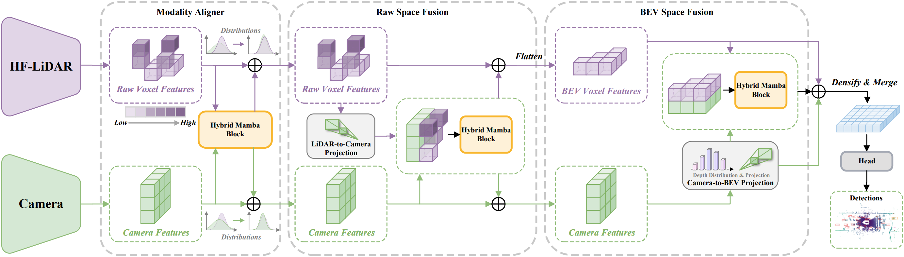
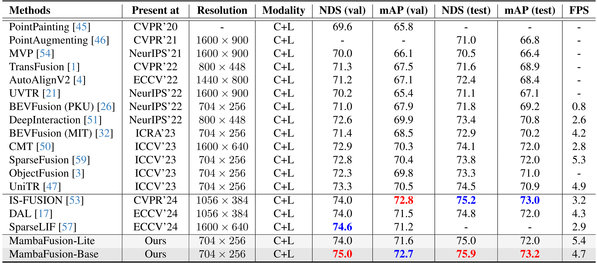

<div align="center">
  <h1>MambaFusion [ICCV 2025]</h1>
  <h3>
    <a href="https://arxiv.org/abs/2507.04369" target="_blank" rel="noopener">
      Height-Fidelity Dense Global Fusion for Multi-modal 3D Object Detection
    </a>
  </h3>
  <p>
    <p>
  <a href="https://veritas12.github.io/" target="_blank" rel="noopener">Hanshi Wang</a><sup>1,2,3,5*</sup>,
  <a href="https://nlpr.ia.ac.cn/users/gaojin/index.htm" target="_blank" rel="noopener">Jin Gao</a><sup>1,2</sup>,
  <a href="https://people.ucas.ac.cn/~huweiming" target="_blank" rel="noopener">Weiming Hu</a><sup>1,2,5,6</sup>,
  <a href="https://zhipengzhang.cn/" target="_blank" rel="noopener">Zhipeng Zhang</a><sup>3,4†</sup>
</p>
  </p>
  <p>
    <sup>1</sup>State Key Laboratory of Multimodal Artificial Intelligence Systems (MAIS), CASIA<br/>
    <sup>2</sup>School of Artificial Intelligence, University of Chinese Academy of Sciences<br/>
    <sup>3</sup>School of Artificial Intelligence, Shanghai Jiao Tong University
    <sup>4</sup>Anyverse Intelligence<br/>
    <sup>5</sup>Beijing Key Laboratory of Super Intelligent Security of Multi-Modal Information<br/>
    <sup>6</sup>School of Information Science and Technology, ShanghaiTech University
  </p>
  <p>
    <sup>*</sup>This work was completed during Hanshi’s remote internship at SJTU.
    <sup>†</sup>Corresponding author.
  </p>
  <p>
    <a href="mailto:hanshi.wang.cv@outlook.com">hanshi.wang.cv@outlook.com</a>,
    <a href="mailto:jin.gao@nlpr.ia.ac.cn">jin.gao@nlpr.ia.ac.cn</a>,
    <a href="mailto:wmhu@nlpr.ia.ac.cn">wmhu@nlpr.ia.ac.cn</a>,
    <a href="mailto:zhipeng.zhang.cv@outlook.com">zhipeng.zhang.cv@outlook.com</a>
  </p>
</div>


### Abstract
We present the first work demonstrating that a pure Mamba block can achieve efficient Dense Global Fusion, meanwhile guaranteeing top performance for camera-LiDAR multi-modal 3D object detection. Our motivation stems from the observation that existing fusion strategies are constrained by their inability to simultaneously achieve efficiency, long-range modeling, and retaining complete scene information. Inspired by recent advances in state-space models (SSMs) and linear attention, we leverage their linear complexity and long-range modeling capabilities to address these challenges. However, this is non-trivial since our experiments reveal that simply adopting efficient linear-complexity methods does not necessarily yield improvements and may even degrade performance. We attribute this degradation to the loss of height information during multi-modal alignment, leading to deviations in sequence order. To resolve this, we propose height-fidelity LiDAR encoding that preserves precise height information through voxel compression in continuous space, thereby enhancing camera-LiDAR alignment. Subsequently, we introduce the Hybrid Mamba Block, which leverages the enriched height-informed features to conduct local and global contextual learning. By integrating these components, our method achieves state-of-the-art performance with the top-tire NDS score of 75.0 on the nuScenes validation benchmark, even surpassing methods that utilize high-resolution inputs. Meanwhile, our method maintains efficiency, achieving faster inference speed than most recent state-of-the-art methods. 

### Overview




### 🔥News
[2025.6.26] MambaFusion is accepted by ICCV25.

[2025.7.03] Code of MambaFusion is released.

[2025.7.11] MambaFusion is reposted by \[[自动驾驶之心](https://mp.weixin.qq.com/s/xLWecCVRXp2vxM6qtJk9Qg)\].

### Installation

If you encounter any problems, please consult the [install.md](docs/install.md) file for the exact version requirements of each package. If the issue still isn’t resolved, feel free to open an issue.
```
conda create -n mambafusion python=3.8

# You can install CUDA 11.8 (if it isn’t already on your system) by running the following command:
# conda install --channel "nvidia/label/cuda-11.8.0" cuda 
pip install torch==2.1.0 torchvision==0.16.0 torchaudio==2.1.0 --index-url https://download.pytorch.org/whl/cu118

# Install extra dependency
pip install -r requirements.txt

pip install https://data.pyg.org/whl/torch-2.1.0%2Bcu118/torch_scatter-2.1.2%2Bpt21cu118-cp38-cp38-linux_x86_64.whl

git clone https://github.com/VERITAS12/MambaFusion.git
cd MambaFusion

# Install nuscenes-devkit
pip install nuscenes-devkit==1.0.5

# Develop
python setup.py develop

python mambafusion_setup.py develop

cd selective_scan
python setup.py develop

cd mamba_diffv/mamba
python setup.py develop
```
### Dataset Preparation

- Please download the official [NuScenes 3D object detection dataset](https://www.nuscenes.org/download) and organize the downloaded files as follows:

```
OpenPCDet
├── data
│   ├── nuscenes
│   │   │── v1.0-trainval (or v1.0-mini if you use mini)
│   │   │   │── samples
│   │   │   │── sweeps
│   │   │   │── maps
│   │   │   │── v1.0-trainval  
├── pcdet
├── tools
```

- The format of the generated data is as follows:

```
OpenPCDet
├── data
│   ├── nuscenes
│   │   │── v1.0-trainval (or v1.0-mini if you use mini)
│   │   │   │── samples
│   │   │   │── sweeps
│   │   │   │── maps
│   │   │   │── v1.0-trainval  
│   │   │   │── img_gt_database_10sweeps_withvelo
│   │   │   │── gt_database_10sweeps_withvelo
│   │   │   │── nuscenes_10sweeps_withvelo_lidar.npy (optional) # if open share mem
│   │   │   │── nuscenes_10sweeps_withvelo_img.npy (optional) # if open share mem
│   │   │   │── nuscenes_infos_10sweeps_train.pkl  
│   │   │   │── nuscenes_infos_10sweeps_val.pkl
│   │   │   │── nuscenes_dbinfos_10sweeps_withvelo.pkl
├── pcdet
├── tools
```
### 🏆Main Results
3D Object Detection (on NuScenes validation)


| Model       | mAP  | NDS  | mATE | mASE | mAOE | mAVE | mAAE | ckpt                                                         | Log                                                         |
| ----------- | ---- | ---- | ---- | ---- | ---- | ---- | ---- | ------------------------------------------------------------ | ----------------------------------------------------------- |
| MambaFusion | 72.7 | 75.0 | 25.8 | 24.1 | 22.3 | 22.1 | 18.8 | [ckpt](https://drive.google.com/drive/folders/1TqvpIHA7plzoFdnGWvFgVYr45bgz-nQ3?usp=sharing) | [Log](https://drive.google.com/drive/folders/1TqvpIHA7plzoFdnGWvFgVYr45bgz-nQ3?usp=sharing) |

3D Object Detection  (on NuScenes test)
| Model       | mAP  | NDS  | mATE | mASE | mAOE | mAVE | mAAE |
| ----------- | ---- | ---- | ---- | ---- | ---- | ---- | ---- |
| MambaFusion | 73.2 | 75.9 | 23.3 | 22.3 | 26.8 | 21.5 | 13.2 |

### Hilbert Curves
You can either download our [pre-generated Hilbert curves](https://drive.google.com/drive/folders/1huzbUotusvePvsR-DyGJc6qfX0Cwubvd?usp=sharing) or generate them yourself by running the `create_hilbert_curve_template.py` script in `tools/hilbert_curves/`. Once generated, place the resulting file into `ckpts/hilbert_template/`.


### Training

```
cd tools
bash scripts/dist_train.sh 4 --cfg_file cfgs/mambafusion_models/mamba_fusion.yaml --sync_bn --pretrained_model ckpts/pretrained.pth --logger_iter_interval 1000
```

### Inference

```
cd tools
bash scripts/dist_test.sh 4 --cfg_file cfgs/mambafusion_models/mamba_fusion.yaml --ckpt checkpoint_epoch_10.pth
```
### ✨Citation
It would be an honor if you found this work useful. If so, please consider citing it as follows:
```
@inproceedings{wang2025mambafusion,
    title={Height-Fidelity Dense Global Fusion for Multi-modal 3D Object Detection},
    author={Hanshi Wang, Jin Gao, Weiming Hu, Zhipeng Zhang},
    booktitle={ICCV},
    year={2025}
}
```
If our code or findings have helped your research, a ⭐ star on our GitHub repository would mean a great deal to us and help keep this project growing!
### Acknowledgments
MambaFusion uses code from a few open source repositories. Without the efforts of these folks (and their willingness to release their implementations), MambaFusion would not be possible. We thanks these authors for their efforts!
- [OpenPCDet](https://github.com/VERITAS12/MambaFusion/blob/main)
- [UniTR](https://github.com/Haiyang-W/UniTR)
- [VoxelMamba](https://github.com/gwenzhang/Voxel-Mamba)
- [Vmamba](https://github.com/MzeroMiko/VMamba)
- [LION](https://github.com/happinesslz/LION)